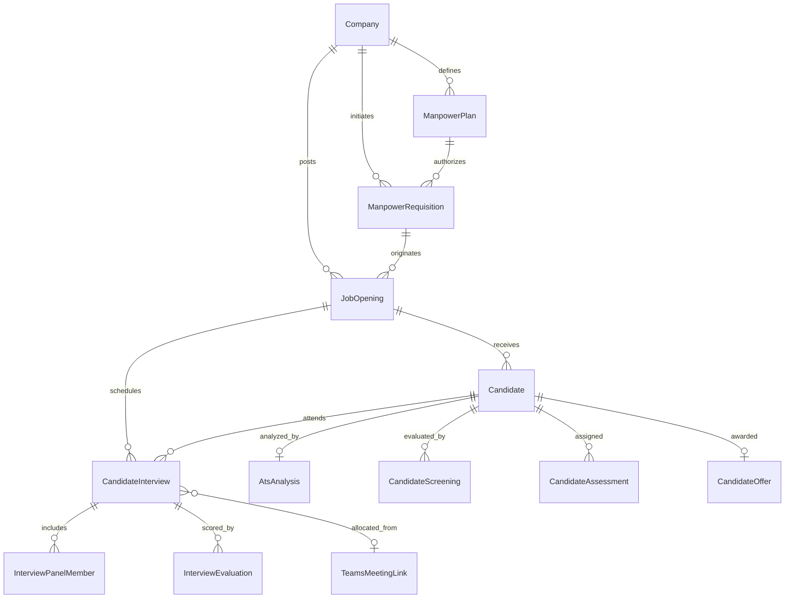

# Recruitment & Applicant Tracking System (ATS) Module — Complete Workflow & Implementation Plan

This implementation plan provides an exhaustive, production-grade blueprint of the **Recruitment & Applicant Tracking System (ATS) Module** in the EHCM (Enterprise Human Capital Management) platform. It covers the full lifecycle from quarterly manpower planning through digital offer issuance and onboarding handover.

---

## 1. End-to-End Workflow Architecture

```mermaid
flowchart TD
    subgraph Phase1["1. Headcount & Requisition Lifecycle"]
        MP["Quarterly Manpower Plan<br/>(Budgeted vs Active Headcount)"] -->|"Headcount Gap Detected"| MR["Manpower Requisition (MR)<br/>(Department Hiring Request)"]
        MR -->|"Approval Workflow<br/>(Manager / Finance / HR Head)"| MRAprv["Approved MR (e.g. MR-2026-001)"]
        MRAprv -->|"Raise Requisition"| JR["Job Opening / Job Requisition (JR)<br/>(e.g. JR-2026-001)"]
        DirectJR["Direct Ad-hoc Job Requisition"] --> JR
    end

    subgraph Phase2["2. Sourcing & Application Intake"]
        JR -->|"Publish"| Portal["Public Careers Portal & Job Board<br/>(/careers & /careers/job/:id)"]
        Portal -->|"Candidate Applies"| AppWizard["Candidate Application Wizard<br/>(Personal, Exp, Edu, Skills, Resume)"]
        DirectAdd["Recruiter Manual Add / Bulk Upload"] --> CandDB[("Candidate Database<br/>(Stage: APPLIED)")]
        AppWizard --> CandDB
    end

    subgraph Phase3["3. ATS Engine & Screening"]
        CandDB -->|"Trigger Async Parse"| ATS["ATS Screening Engine<br/>(Resume Parser + Skills/Exp Matching)"]
        ATS -->|"Score 0-100% & Match Card"| CandScreen["Recruiter Screening Modal<br/>(Ratings, Remarks, Shortlist/Hold/Reject)"]
        CandScreen -->|"SHORTLIST"| Shortlist["Stage: SHORTLISTED"]
    end

    subgraph Phase4["4. Assessment Engine (Optional/Configured)"]
        Shortlist -->|"Assign Assessment"| AssgnModal["Send Assessment Modal<br/>(Test Template, Due Date, Token Link)"]
        AssgnModal -->|"Unique Token URL"| CandTest["Candidate Assessment UI<br/>(/candidate-assessment/:token)"]
        CandTest -->|"Auto-Graded / Evaluated"| AssResult["Pass / Fail Decision<br/>(Score >= Passing %)"]
        AssResult -->|"PASSED"| IntStage["Stage: INTERVIEW"]
    end

    subgraph Phase5["5. Multi-Round Interview & MS Teams"]
        IntStage -->|"Schedule Interview"| SchedModal["Schedule Interview Modal<br/>(Panel, Slot, Teams Pool Link, ICS Invite)"]
        SchedModal -->|"Auto-allocate non-overlapping slot"| TeamsPool["MS Teams Link Pool & SMTP Dispatch"]
        TeamsPool -->|"Meeting Conducted"| Scorecard["Interviewer Evaluation Scorecard<br/>(5-Star Competencies & Recommendation)"]
        Scorecard -->|"Hire Recommendation"| NextRound{"Next Round Needed?"}
        NextRound -->|"Yes"| SchedModal
        NextRound -->|"No / Final Clear"| OffStage["Stage: OFFERED"]
    end

    subgraph Phase6["6. Offer Management & Digital Onboarding"]
        OffStage -->|"Generate Offer"| OfferGen["Offer Letter Creator<br/>(CTC Breakdown, Structure, Joining Date, Terms)"]
        OfferGen -->|"Approval Chain"| OfferApprove["HR Head / Management Approval"]
        OfferApprove -->|"Send Offer"| SmtpOffer["Automated SMTP Dispatch & PDF Attachment"]
        SmtpOffer -->|"Candidate Decision"| Decision{"Offer Accepted?"}
        Decision -->|"Accepted"| StageHired["Stage: HIRED<br/>(Promote to Employee & Workforce Onboarding)"]
        Decision -->|"Declined"| StageRej["Stage: REJECTED / WITHDRAWN"]
    end
```



---

## 2. Pages & Sub-modules Directory

The Recruitment module is structured under `/recruitment` and includes dedicated sub-pages and modal dialogs:

| Route | Component | Purpose & Description |
| :--- | :--- | :--- |
| `/recruitment` or `/recruitment/requisitions` | `JobOpeningsPage.tsx` + `RequisitionsTab.tsx` | Main dashboard displaying metrics, active requisitions, internal MRs, job openings table, filters, and publishing actions. |
| `/recruitment/planning` | `ManpowerPlanningTab.tsx` | Headcount planning grid: budgeted vs active staff, quarter filter, cost center breakdown, MR raised tracker. |
| `/recruitment/requisitions/new` | `CreateJobRequisitionPage.tsx` | 5-step wizard to create a full Job Requisition with cascading organization masters, compensation, and interview setup. |
| `/recruitment/requisitions/create-from-mr/:mrId` | `CreateJobRequisitionPage.tsx` | Requisition creation auto-populated with approved Manpower Requisition metadata. |
| `/recruitment/requisitions/edit/:id` | `CreateJobRequisitionPage.tsx` | Edit existing Job Requisition in draft or ready-to-publish state. |
| `/recruitment/portal` | `CareersPortalTab.tsx` | Admin control panel for Careers Portal preview, active public jobs, direct link copier, and applicant overview. |
| `/recruitment/portal-config` | `PortalConfigurationPage.tsx` | Configuration page for public branding: company logo, banner, theme colors, SEO meta, culture perks, FAQs. |
| `/careers` | `CareersPage.tsx` | Public-facing career site for applicants. Search, filter by department, location, job type. No auth required. |
| `/careers/job/:id` | `CareersJobDetailPage.tsx` | Public job posting details with responsibilities, qualifications, perks, and "Apply Now" trigger. |
| `/candidate-assessment/:token` | `CandidateAssessmentPage.tsx` | Secure public assessment taking interface with timer, anti-cheat, questions, and auto-submit. |
| `/recruitment/candidates` | `CandidatesTab.tsx` | Candidate pipeline with Stage Kanban & Data Table, ATS Match Score, Resume Viewer, Screening Modal, Delete Modal. |
| `/recruitment/interviews` | `InterviewsTab.tsx` | Interview calendar/table, panel scheduler, Teams link pool manager, reminder notifier, scorecard evaluator. |
| `/recruitment/assessments` | `AssessmentsTab.tsx` | Assessment test catalog, candidate assignments list, score tracking, passing criteria. |
| `/recruitment/offers` | `OffersTab.tsx` | Digital offer letter issuance, salary structure CTC calculator, SMTP email delivery, candidate response tracker. |
| `/recruitment/reports` | `RecruitmentReportsTab.tsx` | Visual recruitment analytics: Time-to-Hire, Cost-per-Hire, Source breakdown, Funnel stage conversion rates. |
| `/recruitment/communication` | `CandidateCommunicationTab.tsx` | Centralized candidate messaging, email logs, test SMTP connectivity, and audit records. |

---

## 3. Comprehensive Form Field Matrix & Modals

### 3.1. Manpower Plan Form (`ManpowerPlanningTab.tsx`)
Used by HR/Management to define budgeted headcounts for departments per quarter.

| Field Name | Type / UI Control | Validation & Options | Source / Default |
| :--- | :--- | :--- | :--- |
| `companyId` | Select / Hidden | Required, valid Company ID | Current active company |
| `branchId` | Select Dropdown | Optional, branches filtered by company | All Branches / Specific |
| `departmentName` / `departmentId` | Select Dropdown | Required, from Departments Master | Cascading from Company |
| `role` / `designationId` | Select Dropdown / Input | Required, from Designations Master | e.g. Senior Software Engineer |
| `costCenter` | Select Dropdown | Required, e.g. `CC-102 (Engineering)` | From Cost Centers Master |
| `budgeted` | Number Input | Required, integer >= 1 | e.g. 15 |
| `quarter` | Select Dropdown | Required: `Q1 2026`, `Q2 2026`, `Q3 2026`, `Q4 2026` | Current active Quarter |
| `reason` | Textarea | Required, min 10 chars | Justification for planned headcount |

---

### 3.2. Manpower Requisition Form (Internal MR)
Used by Department Heads to request hiring authorization against an approved Manpower Plan.

| Field Name | Type / UI Control | Validation & Options | Cascading Behavior / Notes |
| :--- | :--- | :--- | :--- |
| `mrNumber` | Read-only Input | Auto-generated: `MR-{YYYY}-{SEQ}` | System assigned |
| `manpowerPlanId` | Select Dropdown | Optional / Recommended | Auto-checks available budgeted openings |
| `departmentId` | Select Dropdown | Required | Auto-fills department name & cost center |
| `costCenter` | Text / Select | Required | Inherited from Plan or Department |
| `role` | Text Input | Required | Target position title |
| `numOpenings` | Number Input | Required, Min 1, Max <= Available planned | Clamped to remaining headcount |
| `joiningDate` | Date Picker | Required, future date | Target date of joining |
| `employmentType` | Select Dropdown | `PERMANENT`, `CONTRACT`, `INTERN` | Default: `PERMANENT` |
| `priority` | Select Dropdown | `LOW`, `NORMAL`, `HIGH`, `CRITICAL` | Default: `NORMAL` |
| `minSalary` / `maxSalary` | Number Input (Lakhs/INR) | Optional, min <= max | Budgeted CTC range |
| `qualification` | Text Input | Required (e.g. B.Tech / MCA) | Mandatory qualification |
| `experience` | Text / Select | Required (e.g. 3-5 Years) | Experience level |
| `requiredSkills` | Textarea / Tags | Optional | Essential skill keywords |
| `workLocation` | Text / Select | Required (e.g. Pune HQ, Remote) | Primary office location |
| `reportingManagerId` | Select Dropdown | Optional, from Active Employees | Future manager |
| `reason` | Textarea | Required | Replacement / New Project Growth |

---

### 3.3. Job Requisition Wizard (`CreateJobRequisitionPage.tsx` — 5 Steps)
The primary enterprise form for creating publishable Job Openings (`JR-{YYYY}-{SEQ}`).

#### Step 1: Manpower Requisition Reference & Organization
* **Source Selection**: Radio choice between `Linked to Approved MR` or `Standalone / Direct Requisition`.
* **Approved MR Picker**: Searchable select showing approved MRs with remaining openings count.
* **Company**: Auto-locked if from MR; dropdown if standalone.
* **Branches**: Multi-branch checkbox or single branch select.
* **Department**: Filtered by Company and Branch.
* **Cost Center**: Auto-populated from Department/MR.
* **Designation**: Select from Designation master or custom title input.
* **Target Positions**: Auto-clamped to MR remaining count or free integer >= 1.

#### Step 2: Job Posting Information
* **Job Title**: Auto-populated from Designation/MR, editable string.
* **Category**: Dropdown (`Engineering`, `Product`, `Human Resources`, `Sales & Marketing`, `Finance`, `Operations`).
* **Job Family**: Dropdown (`Software Engineering`, `Cloud & DevOps`, `Talent Acquisition`, etc.).
* **Seniority Level**: Dropdown (`Entry Level`, `Mid-Senior`, `Director / Executive`).
* **Work Mode**: Select (`On-site`, `Hybrid`, `Remote`).
* **Work Location**: Office branch location or "Work From Home".
* **Employment Type**: Select (`Full-time`, `Part-time`, `Contract`, `Internship`).
* **Hiring Priority**: Badged radio (`Low`, `Medium`, `High`, `Urgent`).
* **Application Start Date**: Date picker (defaults to today).
* **Application Deadline**: Date picker (must be >= Start Date).
* **Job Visibility**: Dropdown (`Public Careers Portal`, `Internal Only`, `Confidential`).
* **Hiring Team Selection**:
  * `Hiring Manager` (Searchable employee dropdown)
  * `Primary Recruiter` (Searchable HR employee dropdown)
  * `HR Business Partner (HRBP)` (Searchable employee dropdown)

#### Step 3: Candidate Requirements & Skills
* **Candidate Type**: Radio options:
  1. `Fresher` (Locks experience to 0, shows Graduation Year picker)
  2. `Experienced` (Shows Min Experience and Max Experience inputs)
  3. `Both Freshers & Experienced`
* **Min / Max Experience (Years)**: Number inputs with validation (`min <= max`).
* **Graduation Year**: e.g. `2024`, `2025`, `2026` (shown for Freshers).
* **Required Skills (Must-Have)**: Interactive `TagInput` with quick-add chips, Enter/comma tag separator, and duplicates rejection.
* **Preferred Skills (Good-to-Have)**: Secondary `TagInput`.
* **Mandatory Qualifications**: Dropdown / text (e.g. `B.E. / B.Tech Computer Science`).
* **Certifications**: Text input (e.g. `AWS Certified Solutions Architect`).
* **Languages Known**: Multi-select tags (e.g. `English`, `Hindi`).
* **Job Summary & Description**: Rich textarea with formatting support.
* **Key Responsibilities**: Bulleted textarea.

#### Step 4: Compensation & Perks
* **Salary Currency**: Select (`INR (₹)`, `USD ($)`, `EUR (€)`).
* **Salary Range (Min & Max)**: Number inputs in Annual CTC (displays formatted Indian Lakhs preview).
* **Show Salary on Careers Portal**: Boolean toggle (Yes/No).
* **Benefits & Perks**: Checkbox matrix (`Health Insurance`, `Flexible Hours`, `Annual Performance Bonus`, `PF & Gratuity`, `Gym Membership`, `Learning Allowance`).

#### Step 5: Interview Process & Review
* **Interview Process Outline**: Textarea outlining stages (e.g. `Round 1: Screening -> Round 2: Tech -> Round 3: Culture`).
* **Number of Interview Rounds**: Number input (Default: 3, Min: 1, Max: 6).
* **Skill Assessment Required?**: Toggle switch. If enabled, prompts test template requirement before interview.
* **Internal Justification & Budget Notes**: Confidential internal notes not shown to candidates.
* **Action Buttons**: `Save as Draft`, `Submit for Review`, `Publish Immediately`.

---

### 3.4. Candidate Application Form (`CandidateApplicationWizard.tsx` & `CandidateFullFormModal.tsx`)
Used by candidates on `/careers/job/:id` and by recruiters adding candidates manually.

| Section | Field | Type | Validation / Behavior |
| :--- | :--- | :--- | :--- |
| **Personal Info** | `firstName` | Text | Required, letters only |
| | `lastName` | Text | Required, letters only |
| | `email` | Email | Required, standard email validation |
| | `phone` | Tel | Required, 10-digit mobile number with country code |
| | `currentLocation` | Text | City, State (e.g. Pune, Maharashtra) |
| **Experience** | `candidateType` | Radio | `FRESHER` or `EXPERIENCED` |
| | `experience` | Number | Total years of experience (0 for fresher) |
| | `currentCompany` | Text | Current employer (or "None / College") |
| | `currentCtc` | Number | Current CTC in LPA |
| | `expectedCtc` | Number | Expected CTC in LPA |
| | `noticePeriod` | Select | `Immediate`, `15 Days`, `30 Days`, `60 Days`, `90 Days` |
| **Education** | `qualification` | Text / Select | Highest degree (B.Tech, MCA, MBA, etc.) |
| | `graduationYear` | Text | Year of passing (e.g. 2023) |
| | `internshipDetails` | Textarea | Prior project or internship experience |
| **Skills & Links** | `skills` | TagInput / Text | Comma-separated list of technical competencies |
| | `linkedinUrl` | URL | Optional LinkedIn profile URL |
| | `githubUrl` | URL | Optional GitHub / Portfolio link |
| **Documents** | `resumeFile` | File Upload | PDF / DOCX, max 10MB (triggers ATS parsing) |
| | `coverLetter` | Textarea / File | Optional personal statement |
| **Consent** | `privacyConsent` | Checkbox | GDPR & Company data processing agreement |

---

### 3.5. Recruiter Candidate Screening Modal (`CandidatesTab.tsx`)
Used to conduct telephone or preliminary profile vetting before interview or assessment.

* **Candidate Profile Snapshot**: Current company, experience years, current vs expected CTC, notice period.
* **Requisition Match Confirmation**:
  * `qualificationMatch`: Radio (`YES`, `NO`, `PARTIAL`)
  * `skillsMatch`: Radio (`YES`, `NO`, `PARTIAL`)
* **Competency Scoring (1 to 5 Stars)**:
  * `technicalRating`: Core subject knowledge
  * `communicationRating`: Verbal and written articulation
  * `profileMatchRating`: Alignment with job requisition
* **Calculated Overall Score**: Weighted average displayed as percentage badge.
* **Screening Remarks**: Recruiter qualitative notes.
* **Decision**: Radio button:
  * `SHORTLIST` → Promotes candidate stage to `SHORTLISTED`
  * `HOLD` → Retains candidate with `ON_HOLD` tag
  * `REJECT` → Prompts mandatory `rejectionReason` and moves to `REJECTED`

---

### 3.6. Schedule Interview Modal (`ScheduleInterviewModal.tsx`)
Used by recruiters to book panel interviews with Microsoft Teams integration.

| Field Name | Type | Options / Auto-behavior |
| :--- | :--- | :--- |
| `candidateId` | Read-only Display | Selected candidate name & email |
| `jobOpeningId` | Read-only Display | Requisition title & code |
| `interviewDate` | Date Picker | Required, valid upcoming date |
| `startTime` | Time Picker | Required (e.g. `10:30 AM`) |
| `durationMinutes` | Select Dropdown | `30 Mins`, `45 Mins`, `60 Mins`, `90 Mins` (Default: 60) |
| `interviewFormat` | Select Dropdown | `Microsoft Teams`, `Google Meet`, `On-site`, `Phone Call` |
| `createTeamsMeeting` | Checkbox Toggle | Auto-allocates non-conflicting slot from Teams pool |
| `meetingLink` | URL Input | Auto-populated if Teams pool checked, or manual link input |
| `panelMemberIds` | Multi-select Dropdown | Mandatory search and assign from Employees Master |
| `panelMemberRoles` | Key-Value Mapping | Role for each member: `Primary Interviewer`, `Observer`, etc. |
| `sendCalendarInvite` | Checkbox Toggle | Generates `.ics` calendar file and dispatches via SMTP |
| `notes` | Textarea | Interview agenda and focus areas for the panel |

---

### 3.7. Interview Evaluation Scorecard Modal (`InterviewDetailsModal.tsx`)
Used by panel interviewers to record structured feedback and hiring recommendations.

* **Competency Ratings (1 to 5 Stars with rubric descriptions)**:
  1. `technicalSkills` (1 = Poor, 5 = Expert)
  2. `communication` (1 = Unclear, 5 = Articulate)
  3. `problemSolving` (1 = Struggled, 5 = Exceptional)
  4. `relevantExperience` (1 = Insufficient, 5 = Highly Relevant)
  5. `roleKnowledge` (1 = Basic, 5 = Deep Understanding)
* **Qualitative Feedback**:
  * `strengths`: Notable positive demonstrations during the interview.
  * `weaknesses`: Gaps, areas of concern, or training needed.
  * `interviewNotes`: Freeform interview transcripts or code review notes.
* **Hiring Recommendation**: Select dropdown:
  * `Strong Hire`
  * `Hire`
  * `Hold`
  * `Reject`
* **Next Action**:
  * `Schedule Next Round` (Triggers `ScheduleNextRoundModal.tsx`)
  * `Advance to Offer Letter` (Direct navigation to `OffersTab.tsx` with candidate parameters)
  * `Reject Candidate`

---

### 3.8. Offer Generation & Issuance Form (`OffersTab.tsx`)
Used by HR to generate, approve, and dispatch formal offer letters.

| Field | Type | Description / Calculations |
| :--- | :--- | :--- |
| `candidateId` | Select / Pre-filled | Selected candidate from `INTERVIEW` or `OFFERED` stage |
| `position` | Text Input | Job title offered |
| `department` | Text / Select | Target department |
| `employmentType` | Select Dropdown | `Full-time`, `Contract`, `Intern` |
| `ctc` | Number / Text | Total Annual Cost-to-Company (e.g. `₹22,00,000 / yr`) |
| `salaryStructure` | Select Dropdown | Standard CTC breakdown: 50% Basic, 20% HRA, 20% Special, 10% PF |
| `joiningDate` | Date Picker | Proposed date of joining |
| `expiryDate` | Date Picker | Offer acceptance deadline date |
| `probation` | Select Dropdown | `3 Months`, `6 Months`, `None` |
| `noticePeriod` | Select Dropdown | `30 Days`, `60 Days`, `90 Days` |
| `location` | Text Input | Base office location (e.g. `Pune HQ`) |
| `reportingManager` | Text / Select | Direct supervisor name |
| `specialTerms` | Textarea | Relocation bonus, sign-on bonus, or equipment clauses |
| `action` | Buttons | `Save Draft`, `Preview PDF`, `Send Offer Email (SMTP)` |

---

## 4. Database Schema & Relations (MySQL / Prisma)

The recruitment domain is governed by 10 interconnected tables in `hrm_db`:



### Key Schema Entities:
1. **`ManpowerPlan`**: `id`, `companyId`, `departmentId`, `designationId`, `departmentName`, `role`, `costCenter`, `budgeted`, `mrRaisedHires`, `quarter`, `reason`, `status`, `isActive`.
2. **`ManpowerRequisition`**: `id`, `mrNumber`, `manpowerPlanId`, `departmentId`, `role`, `numOpenings`, `joiningDate`, `employmentType`, `priority`, `minSalary`, `maxSalary`, `qualification`, `experience`, `requiredSkills`, `workLocation`, `reportingManagerId`, `status` (`PENDING`, `APPROVED`, `REJECTED`), `rejectionReason`.
3. **`JobOpening`**: `id`, `requisitionCode`, `manpowerRequisitionId`, `companyId`, `branchId`, `departmentId`, `designationId`, `title`, `description`, `responsibilities`, `numPositions`, `category`, `jobFamily`, `seniorityLevel`, `workMode`, `workLocation`, `employmentType`, `priority`, `candidateType`, `minExperience`, `maxExperience`, `graduationYear`, `minSalary`, `maxSalary`, `requiredSkills`, `preferredSkills`, `qualification`, `applicationStartDate`, `applicationDeadline`, `jobVisibility`, `numInterviewRounds`, `hasAssessment`, `status` (`DRAFT`, `READY_TO_PUBLISH`, `PUBLISHED`, `ON_HOLD`, `CLOSED`).
4. **`Candidate`**: `id`, `jobOpeningId`, `applicationNumber`, `firstName`, `lastName`, `email`, `phone`, `currentLocation`, `candidateType`, `experience`, `currentCompany`, `currentCtc`, `expectedCtc`, `noticePeriod`, `qualification`, `graduationYear`, `skills`, `resumeUrl`, `coverLetter`, `source`, `stage` (`APPLIED`, `SCREENING`, `SHORTLISTED`, `ASSESSMENT_ASSIGNED`, `ASSESSMENT_COMPLETED`, `ASSESSMENT_PASSED`, `ASSESSMENT_FAILED`, `INTERVIEW`, `OFFERED`, `HIRED`, `ONBOARDED`, `REJECTED`, `WITHDRAWN`).
5. **`AtsAnalysis`**: `id`, `candidateId`, `matchScore` (0-100), `skillsMatched`, `skillsMissing`, `experienceMatchScore`, `qualificationMatchScore`, `extractedData` (JSON), `analyzedAt`.
6. **`CandidateInterview`**: `id`, `interviewCode`, `candidateId`, `jobOpeningId`, `position`, `requisitionCode`, `interviewDate`, `startTime`, `endTime`, `durationMinutes`, `interviewFormat`, `meetingLink`, `teamsMeetingLinkId`, `status` (`SCHEDULED`, `COMPLETED`, `CANCELLED`, `RESCHEDULED`), `notes`.
7. **`CandidateOffer`**: `id`, `candidateId`, `offerCode`, `role`, `department`, `ctc`, `salaryStructure`, `joiningDate`, `expiryDate`, `status` (`DRAFT`, `PENDING_SIGNATURE`, `ACCEPTED`, `DECLINED`, `EXPIRED`), `sentAt`, `documentUrl`.

---

## 5. Integration Subsystems

### 5.1. ATS Resume Parser & Scoring Engine
* Located in `backend/src/modules/recruitment/ats/`.
* When a candidate applies or uploads a resume:
  1. `resume-parser.service.ts` extracts raw text, tokenizes skills, extracts years of experience, email, phone, and degree.
  2. `skill-matching.service.ts` cross-references candidate skills against `JobOpening.requiredSkills` and `preferredSkills` (Exact and synonym fuzzy matching).
  3. `experience-matching.service.ts` evaluates candidate experience against minimum and maximum thresholds.
  4. Overall Match Score computed:
     $$\text{Score} = (0.50 \times \text{SkillMatch}) + (0.30 \times \text{ExpMatch}) + (0.20 \times \text{QualMatch})$$
  5. Displays visual `AtsAnalysisCard` with match percentages, green matched badges, and red missing skills.

### 5.2. MS Teams Link Pool & Calendar Scheduling
* Located in `backend/src/modules/recruitment/teams/`.
* Solves the Microsoft Graph API admin-consent limitation by utilizing a pre-provisioned pool of dedicated enterprise Teams meeting URLs.
* When scheduling:
  1. Inspects active bookings for requested `interviewDate` and `startTime` + `durationMinutes`.
  2. Automatically allocates an available non-overlapping link ID.
  3. Generates an RFC-compliant `.ics` iCalendar payload containing meeting title, organizer, candidate, and Teams join button.
  4. Transmits invitation email via SMTP to both the candidate and assigned panel members.

### 5.3. Email Dispatcher & SMTP Audit Trail
* Located in `backend/src/modules/recruitment/offer-email.service.ts`.
* Configurable with custom SMTP or production Gmail/Outlook service.
* Handles:
  * Application acknowledgement emails
  * Assessment invitations with unique test links
  * Interview invitations with calendar attachments
  * Formal digital offer letter dispatches with itemized CTC tables
  * Full audit log history with timestamp, recipient email, and SMTP response status.

---

## 6. Implementation & Operational Guidelines

1. **Database Single Source of Truth**: All requisitions, candidates, interviews, and offers must strictly write to and read from MySQL. No localStorage or hardcoded mock fallback constants.
2. **Cascading Dropdown Hygiene**: When selecting Company -> Branch -> Department -> Designation in requisition forms, dependent dropdowns must clear and reload synchronously.
3. **Stage Transition Validation**: Ensure candidate cannot jump directly from `APPLIED` to `HIRED` without passing screening and interview evaluations.
4. **Clean Modal States**: All modals (Screening, Schedule Interview, Offer Letter, Assessment) must open in pristine empty states with informative placeholder hints instead of pre-filled fictitious data.

---

## 7. Verification Plan

### Automated Verification
* Verify backend builds with zero TypeScript errors:
  ```powershell
  cd e:\codigix-project\HR-management-module\backend
  npx tsc --noEmit
  ```
* Verify frontend builds with zero TypeScript/Vite errors:
  ```powershell
  cd e:\codigix-project\HR-management-module\frontend
  npm run build
  ```

### Manual Verification Flow
1. **Headcount Planning**: Open `/recruitment/planning`, inspect existing manpower plans, create a new Q4 plan, verify persistence.
2. **Manpower Requisition**: Create an internal MR, approve it in `/recruitment/requisitions`.
3. **Job Opening Wizard**: Click "Raise Requisition" on the approved MR, verify Step 1 pre-populates organization and position count, complete Steps 2-5, and publish.
4. **Candidate Sourcing**: Open `/careers`, click the newly published job, complete `CandidateApplicationWizard`, verify submission appears in `/recruitment/candidates`.
5. **ATS & Screening**: Open candidate card in `/recruitment/candidates`, inspect ATS score, complete screening evaluation, advance to `SHORTLISTED`.
6. **Interview Scheduling**: Schedule interview with panel member and Teams link pool, submit evaluation scorecard, advance to `OFFERED`.
7. **Offer Dispatch**: Create offer in `/recruitment/offers`, verify CTC calculation, send offer email, verify status updates to `PENDING_SIGNATURE`.
